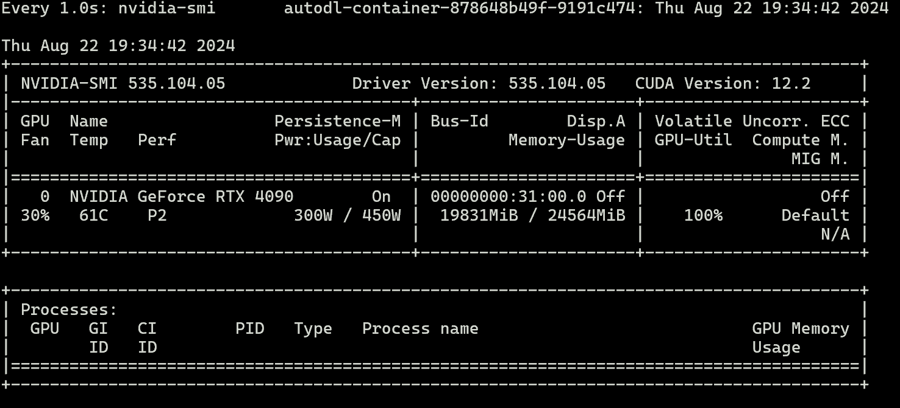

# ChatGLM-6B微调训练

## 0. 安装依赖
```bash
pip install -r requirements.txt
```

## 1. 下载数据集
```bash
mkdir -p ./data 
wget  https://cloud.tsinghua.edu.cn/f/b3f119a008264b1cabd1/?dl=1 -O ./data/AdvertiseGen.tar.gz
tar -xzf ./data/AdvertiseGen.tar.gz -C ./data
```

## 2. 处理数据集
```bash
python convert.py data/AdvertiseGen
```

## 3. 模型训练
```bash
huggingface-cli  download THUDM/chatglm3-6b

CUDA_VISIBLE_DEVICES=0 NCCL_P2P_DISABLE="1" NCCL_IB_DISABLE="1" python finetune.py  data/AdvertiseGen_fix  THUDM/chatglm3-6b  configs/lora.yaml
```
> 训练结果：




## 4. 模型推理
> 在完成微调任务之后，我们可以查看到 `output` 文件夹下多了很多个`checkpoint-*`的文件夹，这些文件夹代表了训练的轮数。<br>
> 我们选择最后一轮的微调权重进行inference

```bash
CUDA_VISIBLE_DEVICES=0 NCCL_P2P_DISABLE="1" NCCL_IB_DISABLE="1" python inference.py  --model_dir output/checkpoint-3000/
```

> 查看Gradio UI： http://127.0.0.1:6006/

